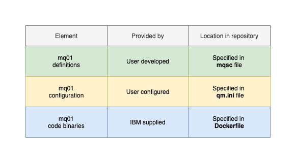

## Overview

This tutorial demonstrates a platform engineering approach to IBM App Connect Enterprise
development and deployment. It demonstrates continuous integration, continuous
deployment, GitOps, Infrastructure as Code and DevOps using containers,
Kubernetes and a set of popular cloud native tools such as ArgoCD and Tekton.

In this tutorial, you will:

1. Create a Kubernetes cluster and image registry, if required.
2. Create an operational repository to store ACE resources that are
   deployed to the Kubernetes cluster.
3. Install ArgoCD to manage the continuous deployment of ACE-related
   resources to the cluster.
4. Create a source Git repository that holds the ACE development artifacts
   for a queue manager.
5. Install Tekton to provide continuous integration of the source ACE
   artifacts. These pipeline ensures that all changes to these artifacts are
   successful built, packaged, versioned and tested before they are delivered
   into the operational repository, read for deployment.
6. Gain experience with the IBM-supplied ACE operator and container.

By the end of the tutorial, you will have practical experience and knowledge of
platform engineering with ACE in a Kubernetes environment.

---

## Introduction

The following diagram shows a CICD pipeline for ACE:


Notice:

- The git repository `ace01-src` holds the source development artifacts for a
  integration server `ace01`.
- A Tekton pipeline uses the `ace01-src` repository to build, package, test,
  version and deliver resources that define the `ace01` ACE integration server.
- If the pipeline is successful, then the YAMLs that define `ace01` are stored in
  the operational repository `ace01-ops` and the container image for `ace01` is
  stored in an image registry.
- Shortly after the changes are committed to the git repository, an ArgoCD
  application detects the updated YAMLs. It applies them to the cluster to create or
  update a running `ace01` integration server.


This tutorial will walk you through the process of setting up this configuration:
- Step 1: Follow [these instructions this
  repository](https://github.com/ace-modernization-demo/ace01-ops#readme) to set up your
  cluster, ArgoCD and the `ace01-ops` repository. When complete, you will return
  to this repository to complete step 2.
- Step 2: Continue with the instructions in this README to create the `ace01-src`
  repository, run a tekton pipeline to populate the `ace01-ops` repository and
  interact with the new or updated integration server`ace01`.

---

## Recreating Environment Variables

If you're doing this tutorial over an extended period, it may result in you
using a different terminal session. In this case, don't forget to re-define the
following environment variables:

```bash
export GITUSER=<GitHub user name>
export GITORG=aceorg-$GITUSER
export GITTOKEN=<PAT copied from GitHub>
export GITCONFIG=$(printf "[credential \"https://github.com\"]\n  helper = store")
```

---

## Creating the `ace01-src` repository

We use this [template repository](https://github.com/ace-modernization-demo/ace01-src) to create
`ace01-src` in our new organization. Forking a template creates a repository with
a clean git history, allowing us to track the history of changes to our integration server `ace01` every time we update `ace01-src`.

> **Note**<br>
>
> Might need to add screenshot here

<br> Click on [this URL](https://github.com/ace-modernization-demo/ace01-src/generate) to fork
from the `ace01-src` template repository:


This screen allows you to define the properties for you copy of the `ace01-src`
repository.

Specifically:

* In the `Owner` dropdown, select your recently created organization, e.g. `aceorg-xxxxx`
* In the `Repository name` field, specify `ace01-src`.
* In the `Description` field, specify `Source repository for ace01 integration server`.
* Select `Public` for the repository visibility.
* Select `Include all branches`.

<br> Click on `Create repository from template`:

<br> This repository will be cloned to the specified GitHub account:


<br> You have successfully created a copy of the `ace01-src` repository in your
organization.

---

## Clone repository to your local machine

We're going to use the contents of the `ace01-src` repository to build the `ace01`
queue manager. First we need to clone this repository to our local machine.

In the terminal window, issue the following command:

```bash
cd $HOME/git/$GITORG-tutorial
git clone https://$GITTOKEN@github.com/$GITORG/ace01-src.git
cd ace01-src
```

which will clone the repository to your local machine.

```bash
Cloning into 'ace01-src'...
remote: Enumerating objects: 69, done.
remote: Counting objects: 100% (69/69), done.
remote: Compressing objects: 100% (58/58), done.
remote: Total 69 (delta 4), reused 52 (delta 2), pack-reused 0
Receiving objects: 100% (69/69), 390.75 KiB | 1.01 MiB/s, done.
Resolving deltas: 100% (4/4), done.
```

---

## The source repository branches

The `ace01-src` repository holds both the development artifacts for the ACE
integration server `ace01` as well as the Tekton pipeline definition to build it.

Issue the following commands to see these branches

```bash
git branch -r
```

which shows two branches (`HEAD` refers to the current branch):

```bash
origin/HEAD -> origin/main
origin/main
origin/pipelines
```

The source artifacts for `ace01` are held in the `main` branch. The `pipelines`
branch holds the Tekton pipeline definitions used to build, test and version
these artifacts.

---

### The `main` branch

The `main` branch folder structure of the `ace01-src` repository reflects the
structure of the `ace01` integration server.

<br> There are three elements of the `ace01` virtual integration server as shown
in the following diagram:



Note
* `ace01` has a set of multi-protocol gateway definitions that are developed by a
  user, each of which is specified in a gateway `local` folder.
* Each gateway has a user specified configurations that is specified in a gateway
  `.cfg` file.
* `ace01` runs these gateways and configuration in a container that uses an image
  based on binary code provided by IBM. We use a `Dockerfile` to identify the
  precise version of this binary code.

Let's explore the repository to see this structure.

```bash
tree -L 1
```

```bash
.
├── LICENSE
├── README.md
├── bin
├── config
├── user
└── xdocs
```

Notice the simplicity of this structure: a `LICENSE` file, this `README` and
associated documentation in `xdocs`, together with three other folders; let's
explore these `bin` and `config` and `user` folders a little more deeply.

Issue the following command:

```bash
tree bin config user
```

which will show the structure of these folders:

```bash
bin
└── Dockerfile
config
├── qm.ini
├── scripts
│   ├── kustomization.yaml
│   ├── start-mqsc.sh
│   └── stop-mqsc.sh
└── yamls
    ├── kustomization.yaml
    └── qmgr.yaml
user
└── mqsc
    └── qmgr.mqsc
```

Note:
* It makes sense for each queue manager to map to a container. It provides a
  natural unit for isolation, management and scaling. The `Dockerfile` in the
  `bin` folder contains the exact version ACE image being used by `ace01`.
* `config` folder
* `user` folder

---

## Work on pipelines

```bash
cd ace01-src
git checkout pipelines
```

---

## Login to cluster

```bash
oc login
```

---

## Locate ACE pipeline source

```bash
cd $HOME/git/$GITORG-tutorial/ace01-src/pipelines/dev-build
ls
```

---

## Create cluster pipeline resources

```bash
oc apply -f ace-clone.yaml
oc apply -f ace-gen-yamls.yaml
oc apply -f ace-push.yaml
oc apply -f ace-dev-pipeline.yaml
oc apply -f ace-store-yamls.yaml
oc apply -f ace-build-image.yaml
oc apply -f ace-test.yaml
```

---

## Customize pipeline

```bash
envsubst <ace-dev-pipelinerun.yaml.tmpl > ace-dev-pipelinerun.yaml
```

## Run pipeline

```bash
oc create -f ace-dev-pipelinerun.yaml
```

In the following command replace `xxxxx` with the new pipeline run identifier:

```bash
tkn pipelinerun logs, ace-dev-pipeline-run-xxxxx -n ace01-dev -f
```

## View pipelinerun in the web console

Show progress in `tkn` command line tool?

## Try out service using API tool

Now that the `ace01` integration service is running the BookingService, we can test it.

We are going to use the REST API.

You can use any API test tool; [RESTER](https://addons.mozilla.org/en-GB/firefox/addon/rester/) is good if you use Firefox.


## Congratulations

Well done! You have successfully completed this tutorial. You have

* Configured a Kubernetes cluster for Platform Engineering including CICD and GitOps.
* Built and deployed a queue manager, deployed it, and interacted with it.